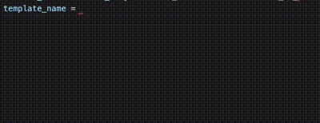

# Welcome to Well Django Autocompletion

## Why to use this extension?
This extension is aimed at developers who like VSCODE but also like the amazing PYCHARM 
functionalities, like the autocompletion for template name and url, plus a very fast way
to go to the views clicking on url names.

### Django templates
* Autocompletion when using `include` and `extends` in HTML files.
* Autocompletion when defining variables or dict keys in python files, like `template_name` in class based views.

### Django urls
* Autocompletion when using `url` tag in HTML files, plus if you are using `include` and need to pass an specific context using url arguments patterns.
* Autocompletion when calling `reverse`, `reverse_lazy` and declaring variables and dict keys that looks like you wanna specify an url name.
* Definition provider using `CMD+click` or `CTRL+click` on a url name will take you to the url definition file.

### Django static files
* Autocompletion when using `static` tag or if you are using `src` attribute in HTML and Python files, `src` also works for javascript files.
* Definition provider using `CMD+click` or `CTRL+click` on a static file will take you to the static file(Only works in HTML files).
 

### Usage examples

